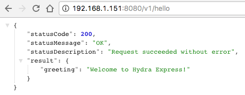

# Deploying Node Microservices to AWS using Docker

In this two-part series, we'll look at the building and deploying microservices to Amazon's AWS using Docker. In this first part, we'll focus on building a simple microservice and packaging it in a docker container. We'll also step through hosting the container on AWS. In part two, we'll build a cluster on AWS using Docker Swarm mode, where we'll consider networking implications.

Make no mistake, this is fairly involved stuff. I'm going to soften the blow in order to make this topic approachable by a wider audience. If you're a pro at docker and AWS then you can skim through this article and look forward to part two.

Because doing such a thing is plagued with lots of complexity, we're going to use a microservices library called [Hydra](https://www.npmjs.com/package/hydra)  -  which will greatly simply the effort while offering considerable scalability benefits. Even if you choose not to use Hydra, the information in this post should help you get started with AWS and Docker.

A quick recap if you're wondering what this Hydra thing is. Hydra is a NodeJS package which facilitates building distributed applications such as Microservices. Hydra offers features such as service discovery, distributed messaging, message load balancing, logging, presence, and health monitoring. As you can imagine, those features would benefit any service living on cloud infrastructure.

If you'd like to learn more, see two of my earlier posts here on RisingStack. The first is [Building ExpressJS-based microservices using Hydra](https://community.risingstack.com/tutorial-building-expressjs-based-microservices-using-hydra/), and the second is [Building a Microservices Example Game with Distributed Messaging](https://community.risingstack.com/building-a-microservices-example-game-with-distributed-messaging/). A microservice game? Seriously? For the record, I do reject claims that I have too much time on my hands. 😃

We'll begin by recapping docker containerization  - just in case you're new to this. Feel free to skim or skip over the next section, if you're already familiar with Docker.

## Containerization?

Virtual Machine software has ushered in the age of software containerization where applications can be packaged as containers making them portable and easier to manage. Docker is a significant evolution of that trend.

Running microservices inside of containers means we're able to run containers locally on our laptops and run the same containers in the cloud. This greatly helps to reduce bugs which can be found during development as the environment your software runs in can be identical to how it will be run in production.

Packaging a NodeJS microservice inside of a Docker container is straightforward.  To begin with, you should download and install the Docker community edition from docker.com - if you haven't already done that.

Here is an overview of the containerization steps:

* Build a simple service
* Create a Dockerfile
* Build a container
* Run a container

The tag for the command above specifies your service name and version. It's a good practice to prefix that entry with your username or company name. For example: `cjus/hello-service:0.0.1` If you're using Docker hub to store your containers then you'll need definitely need to prefix your container name. We'll touch on Docker hub a bit later.

Let's take a look at each of the steps above.

### Building a simple microservice

To build our simple microservice we'll use a package called Hydra-express, which creates a microservice using Hydra and ExpressJS. Why not just ExpressJS? By itself, an ExpressJS app only allows you to build a Node server and add API routes. However, that basic server isn't really a complete microservice. Granted that point is somewhat debatable - shades of gray if you will. In comparison, a Hydra-express app includes functionality to discover other Hydra apps and load balance requests between them using presence and health information. Those capabilities will become important when we consider multiple services running and communicating with each other on AWS and in a Docker Swarm cluster. Building Hydra and Hydra-Express apps are covered in more detail in my earlier [RisingStack articles](https://community.risingstack.com/author/carlos/).

This approach does however, require that you're running a local instance of Redis or have access to a remote one. In the extremely unlikely event that you're unfamiliar with Redis - checkout this [quick start page](https://www.hydramicroservice.com/docs/quick-start/step1.html).

In the interests of time, and to avoid manually typing the code for a basic hydra-express app - we'll install [Yeoman](http://yeoman.io/learning/) and Eric Adum's excellent [hydra app generator](https://github.com/flywheelsports/generator-fwsp-hydra). A Yeoman generator asks a series of questions and then generates an app for you. You can then customize it to suit your needs. This is similar to running the [ExpressJS Generator](https://expressjs.com/en/starter/generator.html).

```shell
$ sudo npm install -g yo generator-fwsp-hydra
```

Next, we'll invoke Yeoman and the hydra generator.  Name your microservice `hello` and make sure to specify a port address of 8080 - you can then choose defaults for the remaining options.

```shell
$ yo fwsp-hydra
fwsp-hydra generator v0.2.10   yeoman-generator v1.1.1   yo v1.8.5
? Name of the service (`-service` will be appended automatically) hello
? Your full name? Carlos Justiniano
? Your email address? cjus34@gmail.com
? Host the service runs on?
? Port the service runs on? 8080
? What does this service do? Says hello
? Does this service need auth? No
? Is this a hydra-express service? Yes
? Set up a view engine? No
? Set up logging? No
? Enable CORS on serverResponses? No
? Run npm install? No
   create hello-service/specs/test.js
   create hello-service/specs/helpers/chai.js
   create hello-service/.editorconfig
   create hello-service/.eslintrc
   create hello-service/.gitattributes
   create hello-service/.nvmrc
   create hello-service/.gitignore
   create hello-service/package.json
   create hello-service/README.md
   create hello-service/hello-service.js
   create hello-service/config/sample-config.json
   create hello-service/config/config.json
   create hello-service/scripts/docker.js
   create hello-service/routes/hello-v1-routes.js

Done!
'cd hello-service' then 'npm install' and 'npm start'
```

You'll end up with a folder called hello-service.

```shell
$ tree hello-service/
hello-service/
├── README.md
├── config
│   ├── config.json
│   └── sample-config.json
├── hello-service.js
├── package.json
├── routes
│   └── hello-v1-routes.js
├── scripts
│   └── docker.js
└── specs
    ├── helpers
    │   └── chai.js
    └── test.js

5 directories, 9 files
```

In the folder structure above the `config` directory container a `config.json` file. That file is used by Hydra-express to specify information about our microservice.

The config file will look something like this:

```javascript
{
  "environment": "development",
  "hydra": {
    "serviceName": "hello-service",
    "serviceIP": "",
    "servicePort": 8080,
    "serviceType": "",
    "serviceDescription": "Says hello",
    "plugins": {
      "logger": {
        "logRequests": true,
        "elasticsearch": {
          "host": "localhost",
          "port": 9200,
          "index": "hydra"
        }
      }
    },
    "redis": {
      "url": "127.0.0.1",
      "port": 6379,
      "db": 15
    }
  }
}
```

If you're using an instance of Redis which isn't running locally you can specify its location under the `hydra.redis` config branch.  You can also specify a Redis url such as `redis://:secrets@example.com:6379/15` and you can remove the `port` and `db` key values from the config.

After cd-ing into the folder you can build using `npm install`, and after running `npm start` you should see:

```shell
$ npm start

> hello-service@0.0.1 start /Users/cjus/dev/hello-service
> node hello-service.js

INFO
{ event: 'start',
  message: 'hello-service (v.0.0.1) server listening on port 8080' }
INFO
{ event: 'info', message: 'Using environment: development' }
serviceInfo { serviceName: 'hello-service',
  serviceIP: '192.168.1.151',
  servicePort: 8080 }
```

Take note of the serviceIP address `192.168.1.151` - yours will be different. 

Using the IP address and Port above we can access our `v1/hello` route from a web browser:



Note, I'm using the excellent [JSON Formatter](https://chrome.google.com/webstore/detail/json-formatter/bcjindcccaagfpapjjmafapmmgkkhgoa) chrome extension to view JSON output in all of it's glory. Without a similar browser extension you'll just see this:

> {"statusCode":200,"statusMessage":"OK","statusDescription":"Request succeeded without error","result":{"greeting":"Welcome to Hydra Express!"}}

OK, let's dockerize this thing!

### Creating the Dockerfile

In order to containerize our microservice, we need to provide instructions to Docker. This is done using a text file called a `Dockerfile`.  If you're following along and used the hydra generator, you already have a way to easily create a Dockerfile. You simply type `$ npm run docker build` and the docker.js file we saw earlier will be invoked to create your Dockerfile. That's a quick way to get the job done - but if you've never created a Dockerfile following in this section will be educational.

Here is a sample Dockerfile:

```
FROM node:6.9.4-alpine
MAINTAINER Carlos Justiniano cjus34@gmail.com
EXPOSE 8080
RUN mkdir -p /usr/src/app
WORKDIR /usr/src/app
ADD . /usr/src/app
RUN npm install --production
CMD ["npm", "start"]
```

The first line specifies the base image that will be used for your container. We specify the light-weight (Alpine) image containing a minimal Linux and NodeJS version 6.9.4  -  however, you can specify the larger standard Linux image using: FROM: node:6.9.4

Other important entry, EXPOSE, is the port that our microservice listens on. The remaining lines specify that the contents of the current directory should be copied to /usr/src/app inside of the container. We then instruct Docker to run the npm install command to pull package dependencies. The final line specifies that npm start will be invoked when the container is executed. You can learn more on the [Dockerfiles documentation page](https://docs.docker.com/engine/reference/builder/).

### Build the container

There is one thing we need to do **before** we build our container. We need to update on microservice's config.json file. You may be pointing to a local instance of Redis like this:

```
    "redis": {
      "url": "127.0.0.1",
      "port": 6379,
      "db": 15
    }
```

You'll need to change the IP address pointing to localhost at 127.0.0.1 - because when our service is running in a container its network is different! Yes friends, welcome to the world of docker networking. So in the container's network - Redis isn't located at 127.0.0.1 - in fact, Redis is running outside of our container.

There are lots of ways of dealing with this, but one way is simply to change the URL reference to a named DNS entry - like this:

```
    "redis": {
      "url": "redis",
      "port": 6379,
      "db": 15
    }
```

That basically says "when looking for the location of redis, resolve the DNS entry named redis to an IP address". We'll see how this works shortly.

With the config change and a Dockerfile on hand we're now ready to package our microservice inside of a container.

```shell
$ docker build -t hello-service:0.0.1 .
```

Note: Don't forget the trailing period which specifies the working directory.

You should see a long stream of output as your project is being loaded into the container and npm install is being run to create a complete environment for your microservice.

### Running our container

We can run our container using one command:

```shell
$ docker run -d -p 8080:8080 \
   --add-host redis:192.168.1.151 \
   --name hello-service \
   hello-service:0.0.1
```

We use the `docker run` command to invoke our container and service. The `-d` command specifies that we want to run in daemon (background mode) and the `-p` command publishes our services ports. The port syntax says: "on this machine use port 8080 (first portion) and map that to the containers internal port (second portion)" which is also 8080. The `--add-host` allows us to specify a DNS entry called `redis` to pass to our container - how cool is that? We also name the service using the  `--name` flag  -  that's useful otherwise docker will provide a random name for our running container. The last portion shown is the service name and version. Ideally, that should match the version in your package.json file.

### Communicating with our container

At this point you should be able to open your web browser and point it to `http://localhost:8080/v1/hello` to access your service - the same way we did earlier when our service was running outside of the container. Using docker commands you can start, stop, remove containers and a whole lot more. Checkout this handy [command cheat sheet](https://github.com/wsargent/docker-cheat-sheet).

### Sharing your containers

Now that you've created a container you can share it with others by publishing it to a container registry such as [Docker Hub](https://hub.docker.com/). You can setup a free account  which will allow you to publish unlimited public containers, but you'll only be able to publish one private container. As they say in the drug business: "The first one is free". To maintain multiple private containers you'll need a paid subscription. However, the plans start at a reasonably low price of $7 per month.  You can forgo this expense by creating your own [local container repository](https://docs.docker.com/registry/deploying/). However, this isn't a useful option when we need to work in the cloud.

You, or others, can pull a container image from your docker hub repo using one simple command:

```shell
$ docker pull cjus/hello-service:0.0.1
```

## A look at configuration management

If you refer back to our sample microservice's config.json file you'll realize that it got packaged in our docker container. That happened because of this line in our Dockerfile which instructs docker to copy all the files in the current directory into the `/usr/src/app` folder inside of the docker container.

```
ADD . /usr/src/app
```

So that included our `./config` folder.  Packaging a config file inside of the container isn't the most flexible thing to do - after all, we might need a different config file for each environment our service runs in.

Fortunately, there an easy way to specify an external config file.

```shell
$ docker run -d -p 8080:8080 \
   --add-host redis:192.168.1.151 \
   -v ~/configs/hello-service:/usr/src/app/config \
   --name hello-service \
   hello-service:0.0.1
```

The example above has a `-v` flag which specifies a data "volume". The mapping consists of two directories separated by a colon character. 

So: `source-path`:`container-path`

The volume points to a folder called `configs` in my home directory. Inside that folder I have a config.json file. That folder is then mapped to the `/usr/src/app/config` folder inside of the docker container.

When the command above is issued the result will be that the container's `/usr/src/app/config` will effectively be mapped to my `~/configs` folder. Our microservice still thinks it's loading the config from its local directory and doesn't know that we've mapped that folder to our container host.

We'll look at a much cleaner way of managing config files when we deploy our containers to a docker swarm in part two of this series.  For now, we'll just roll with this.

## Moving to Amazon Web Services

I have to assume here that you're familiar with using AWS and in particular creating EC2 instances and later ssh-ing into them.  And that you're comfortable creating security groups and opening ports. If not, you can still follow along to get a sense of what's involved.

